# Example comparative thread_pool_hybrid vs connection_per_thread handler

This was run on AWS r5.8xlarge with Ubuntu 24.04 and MySQL 8.0.4 with the BMK-kit installed and running on the same machine.

I modified the buffer pool to be able to fit into DRAM. The test warms up file system cache by running a 1024 client test for 90 seconds, then begins recording the test results and starts back at 1 for 90 secs, then 4, then 16 ... etc. It does this warm up once for each configuration. For both thread_pool_hybrid and the enterprise thread_pool, I take the default settings for each. I can tune the enterprise thread_pool if someone can give me some rules or settings that will work well.

I don't understand why the test jumps in events/sec at the end of some of the tests, but only for thread_pool_hybrid. But the recorded test files look correct so I'm keeping it.

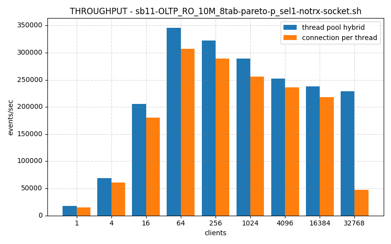
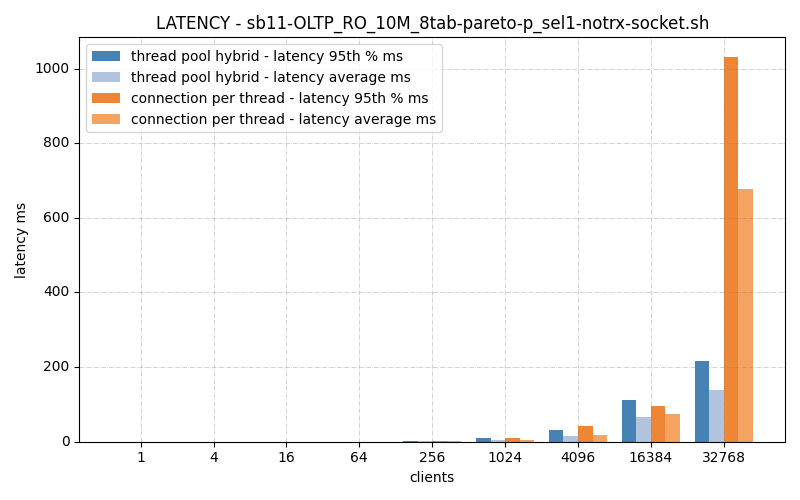
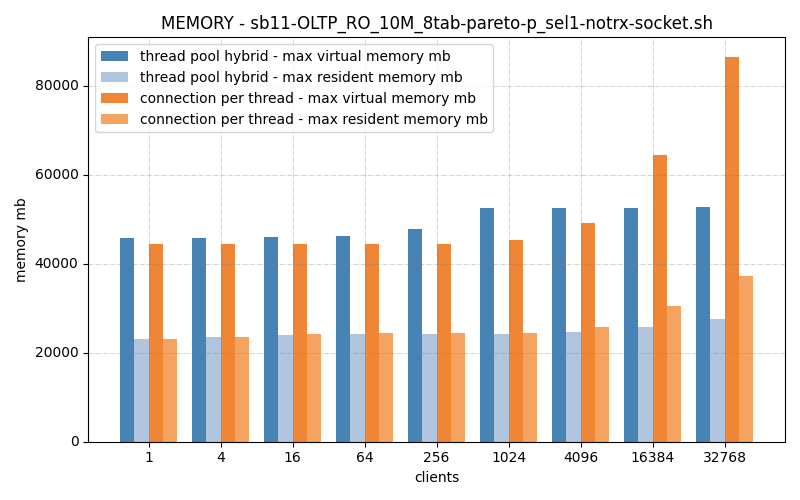
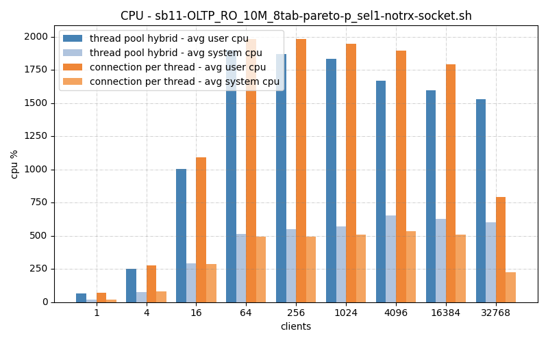
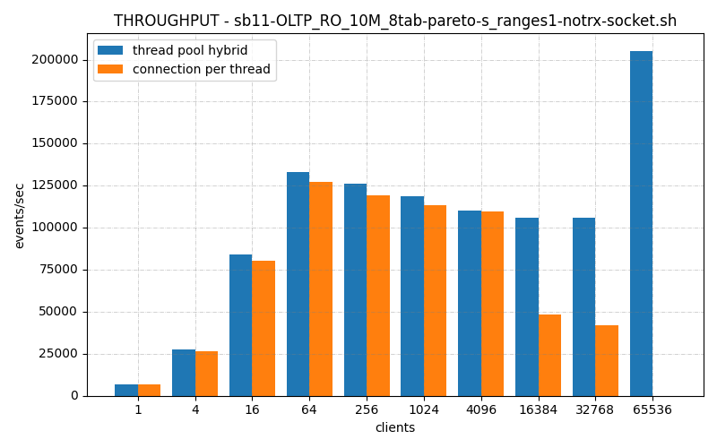
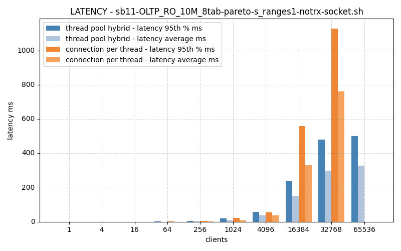
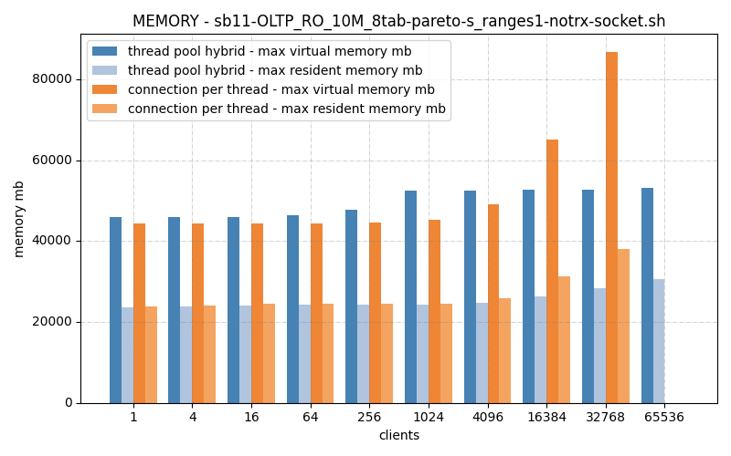
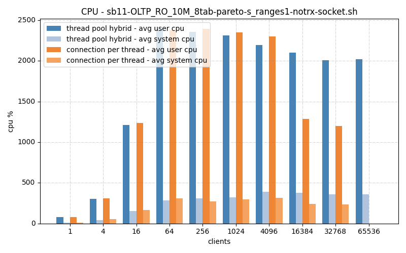
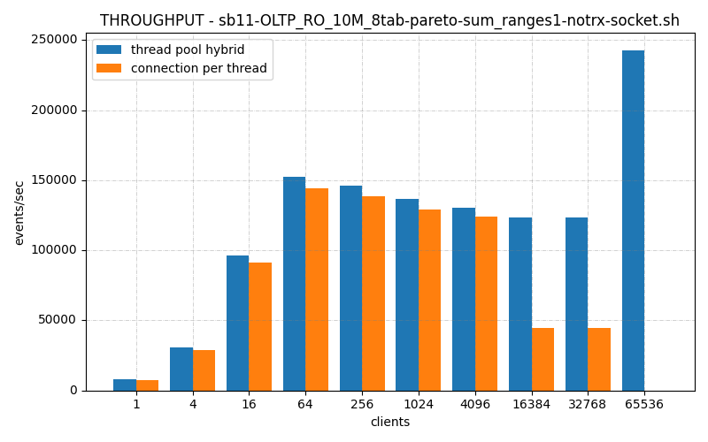
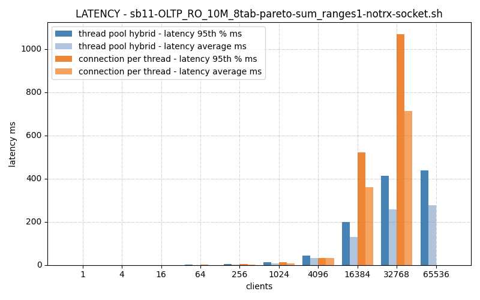
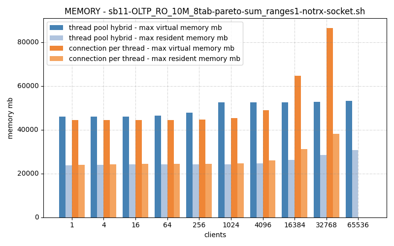
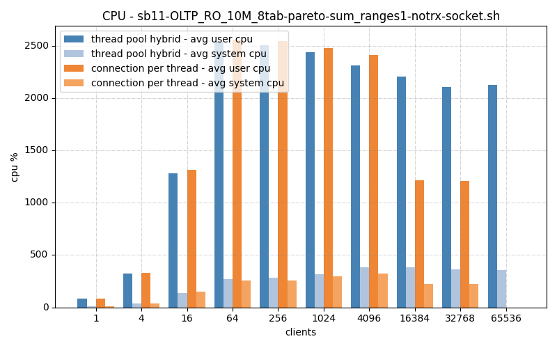
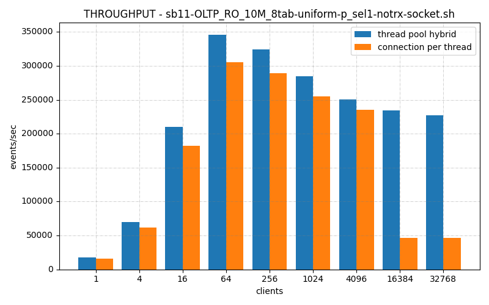
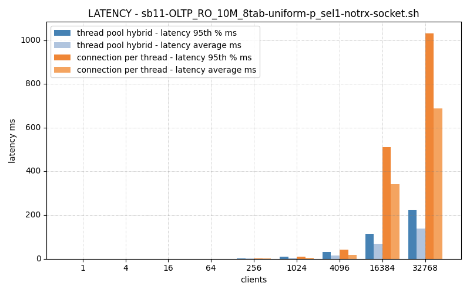
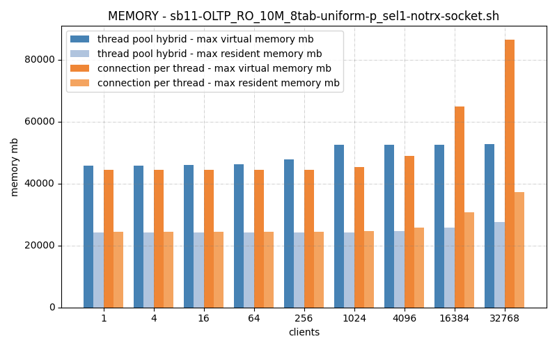
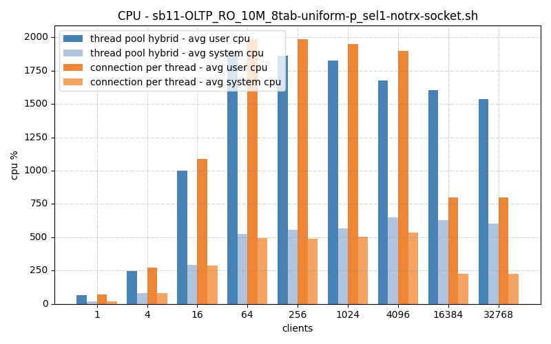
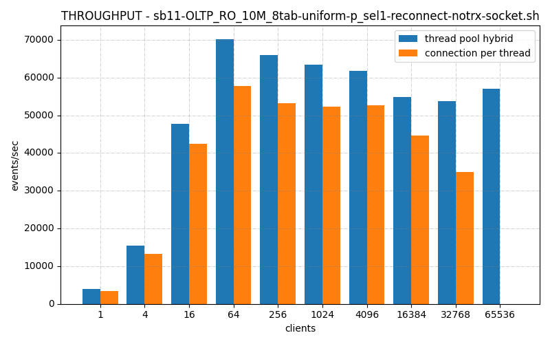
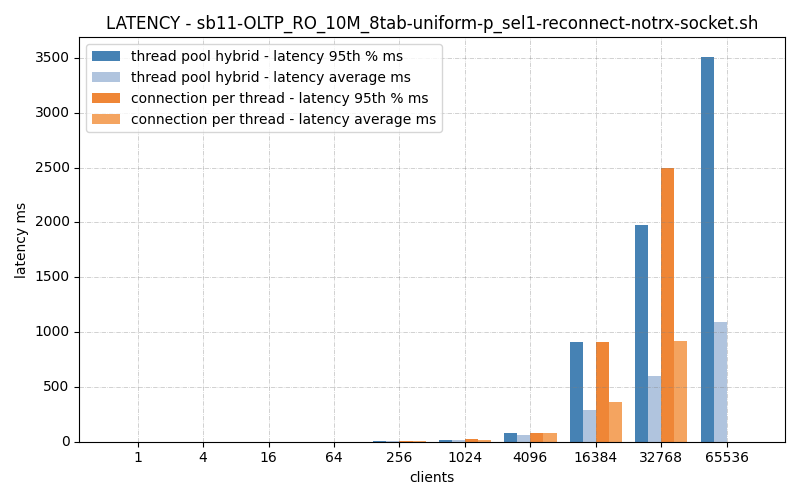
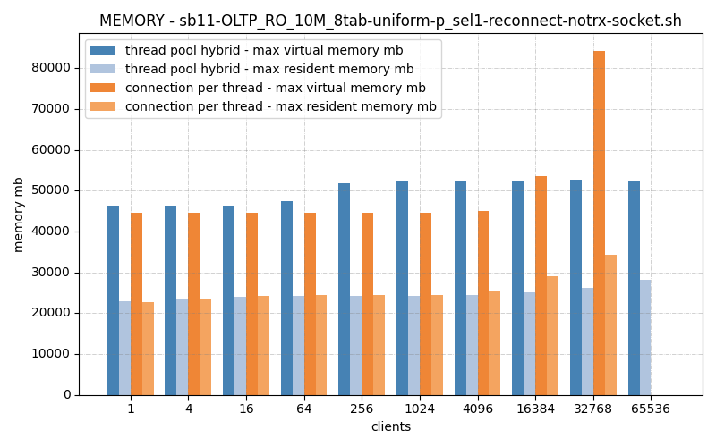
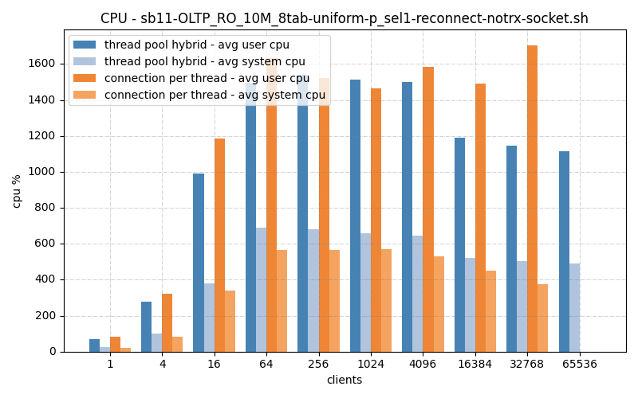
